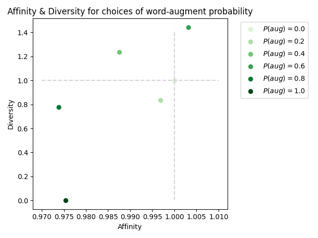

# Experiments with Text Augmentation Tools

A repository for code producing one of our augmentation analysis results. The code should be adaptable to all 
other augmentations supported by `nlpaug`, though only word substitution with BERT is implemented. Our final result is
the following plot:

## Re-running these experiments

A given training run can be completed using `python train.py runs/[some run config]`. `runner.py` is a utility 
provided to run these in a queue given a fixed number of GPUs. 

`eval_affinity_diversity.py` is used to log the one result not included at training time, a clean-trained model's test
accuracy on augmented data. 

`export_csv.py` downloads and processes the results from Weights & biases. 

[Our `wandb` runs can be viewed here](https://wandb.ai/kingb12/text-aug-experiments)

`generate_plot_from_runs.py` constructs the above plot from this data.
